# ⚡ VL_Vector & String - Optimized C++ Containers


> A high-performance, STL-compatible vector implementation featuring **Small Buffer Optimization (SBO)** to minimize expensive heap allocations.

---

## 🧠 1. Architecture: Stack-First Allocation
Unlike a standard `std::vector` which immediately jumps to Heap memory, `vl_vector` stays on the **Stack** as long as possible. This reduces cache misses and eliminates allocation overhead for small objects.

```mermaid
flowchart LR
    %% Styles
    classDef stack fill:#e6fffa,stroke:#4fd1c5,stroke-width:2px,color:#234e52;
    classDef heap fill:#fff5f5,stroke:#fc8181,stroke-width:2px,color:#63171b;
    classDef check fill:#ebf8ff,stroke:#63b3ed,stroke-width:2px,color:#2c5282;

    In([Input Data]) --> Check{Fits in Static Cap?}
    Check -- Yes --> Stack[<b>Stack Buffer</b><br/>⚡ Fast Access<br/>📦 Zero Allocation]:::stack
    Check -- No --> Heap[<b>Dynamic Heap</b><br/>🔄 Flexible Size<br/>📈 1.5x Growth]:::heap
    
    class Check check
```



---

## 📉 2. Why Amortized O(1)?
The vector uses a **Geometric Growth Strategy (1.5x)**.
When the capacity is full, we perform one "expensive" operation (Allocation + Copy), which creates enough free space for many subsequent "cheap" operations.

```mermaid
flowchart TD
    %% Styles
    classDef cheap fill:#c6f6d5,stroke:#2f855a,stroke-width:2px,color:#22543d;
    classDef expensive fill:#fed7d7,stroke:#c53030,stroke-width:4px,color:#742a2a;
    
    Step1[Vector Full] --> Resize[<b>⚠️ Heavy Operation</b><br/>Alloc New Block + Copy Elements<br/>Cost: O_N]:::expensive
    Resize --> Space[New Capacity Created]
    Space --> Push1[Push Back 1<br/>Cost: O_1]:::cheap
    Push1 --> Push2[Push Back 2<br/>Cost: O_1]:::cheap
    Push2 --> Push3[Push Back ...N<br/>Cost: O_1]:::cheap
    Push3 -.->|Many cheap ops later...| Step1
```



---

## 🛠️ Features
* **Hybrid Memory Management:** Seamless transition from Stack to Heap memory.
* **STL Compatibility:** Full implementation of `RandomAccessIterator`, allowing usage with `std::sort`, `std::find`, and range-based loops.
* **Exception Safety:** Strong guarantee using `noexcept` specifications where applicable.
* **vl_string:** A specialized string class inheriting from `vl_vector<char>`, providing custom string manipulation capabilities with the same memory benefits.

---

## 💻 Usage Example

### 1. Vector with Static Optimization
By default, the vector holds 16 elements on the stack. You can customize this:

```cpp
#include "vl_vector.hpp"
#include <iostream>

int main() {
    // Optimized: Stores up to 32 integers on the Stack before touching the Heap
    vl_vector<int, 32> vec; 
    
    vec.push_back(10); 
    vec.push_back(20);

    // Full STL Iterator Support
    for (const auto& val : vec) {
        std::cout << val << " ";
    }
    return 0;
}
```

### 2. Using vl_string
A lightweight string implementation built on top of the vector architecture.

```cpp
#include "vl_string.hpp"
#include <iostream>

int main() {
    vl_string<> myStr = "Hello World"; // Uses default static capacity
    myStr += " from vl_string";        // Appends efficiently
    
    std::cout << (std::string)myStr << std::endl; // Implicit casting to std::string
    return 0;
}
```

---

## ⚙️ Time Complexity
| Operation | Complexity | Description |
| :--- | :--- | :--- |
| **Push Back** | `O(1)` (Amortized) | The heavy resizing cost is distributed over the many cheap insertions (Geometric Growth). |
| **Random Access** | `O(1)` | Direct pointer arithmetic access (Stack or Heap). |
| **Destruction** | `O(1)` / `O(N)` | Trivial for stack; Linear for heap (if complex types). |

---

## 📥 Installation
Since this is a header-only library, integration is simple:

1.  Clone the repository:
    ```bash
    git clone https://github.com/shalevbarda/STL-VL_Vector.git
    ```
2.  Include the headers in your project:
    ```cpp
    #include "vl_vector.hpp"
    #include "vl_string.hpp"
    ```

---
*Developed by [Shalev Barda](https://github.com/shalevbarda)*
